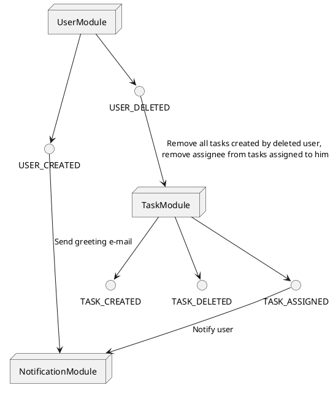
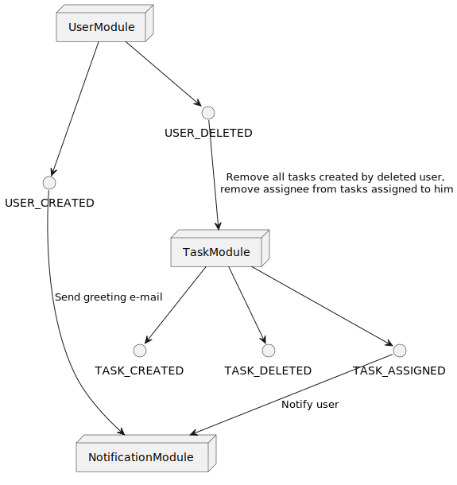
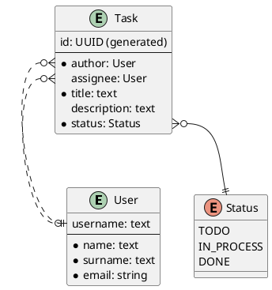
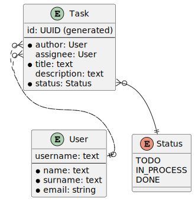

# Demo service

## Функциональные требования
<br><br>
<b>Роли:</b>
1) <b>Пользователь</b>
   * Просмотр товаров из каталога
   * Добавление/удаление товаров в заказ
   * Оформление/бронирование заказа
   * Уточнение некоторых деталей заказа
   * Изменение списка товаров в заказе
   * Выбор способа получения товара(доставка)
   * Запрос у сервера слотов времени доставки
   * Выбор слота времени доставки и обновление заказа
   * Оплата заказа
   * Получение уведомления от внешней системы о том, что есть незавершенный заказ
<br><br>
2) <b>Магазин</b>
   * Трекает время от начала сбора до бронирования заказа
   * Определение “брошенных” заказов(созданные заказы, которые пользователь не забронировал).
   * Делает запрос в систему на доставку товара
   * Показывает сколько времени займет доставка
   * Генерирует слоты доставки на основании внутренних параметров магазина и параметров внешней системы
   * Магазин выбирает оптимальный аккаунт, чтобы доставить заказ в выбранное время
<br><br>
3) <b>Сервис оповещений</b>
   * Отправляет пользователю сообщение о том, что у него есть незавершенный заказ
   * Отправляет в систему информацию о совершенном действии(event)
<br><br>
4) <b>Сервис оплаты</b>
   * Получает данные о пользователе и сумме заказа
   * Делает рефанд стоимости, если есть уведомление о том, что доставка вовремя не доставила заказ
<br><br>
5) <b>Сообщение</b>
   * Отправляется во внешнюю систему и содержит уникальную для заказа ссылку url
<br><br>
4) <b>Исполнитель(курьерская служба)</b>
   * Выполняет доставку товара
   * Получает информацию о заказе, если пользователь его оплатил

## Нефункциональные требования
* Обрабатывать различное поведение внешней системы, включая частичную и полную недоступность, увеличение времени отклика и тд.
* Ведение полной истории обращений к внешней системе, обязательно включающее результаты обращения, длительность и уникальный id операции, который генерирует внешняя система при обращении.
* Возможность продолжения работы при недоступности некоторых сервисов.
* Масштабируемость, способности расти и развиваться по мере роста объема данных и количества пользователей.
* Реализация "надежного" межпроцессного взаимодействия, реализация "fault-tolerant" систем. (Поэтому нашему интернет-магазину придется интегрироваться и взаимодействовать с набором "внешних" систем для делегирования некоторых обязанностей - оплата, отправка сообщений пользователям, осуществление доставки товара).
* Удовлетворение минимального публичного API. Данное API будет использовать сервис тестирования для эмулирования действий пользователя, а также для проверки консистентности системы и ее отдельных компонентов.
* Должно удовлетворять списку метрик.
* Статус заказа должен меняться так же как описано в машине состояний
* Минимальное количество обращений к внешней системе, так как каждое обращение платное.


## Ubiquitous language

   * Покупатель/User - человек, который просматривает и покупает товары в магазине
   * Добавление товара в корзину/Add product to shopping cart
   * Удаление товара из корзины/Delete product from shopping cart
   * Оформление заказа/Финализация/Бронирование/Ordering - процесс бронирования товаров, чтобы в дальнейшем их оплатить
   * Оформление доставки товара/Ordering delivery - процесс ввода данных пользователем
   * Оплата заказа/Payment - процесс оплаты товаров
   * Платеж/Оплата/Transaction - перевод средств от одного пользователя другому
   * Товар/Позиция/Product - объект, который может просматривать и приобретать покупатель
   * Статус товара/Product status - состояние товаров в магазине
   * Доступен/Available - есть в наличии в магазине
   * Отсутствует/Missing - нет в наличии в магазине
   * Курьерская служба/Доставка/Внешняя система/Delivery Service - сервис, который отвечает за доставку товаров
   * Доставка товара/Delivering - процесс доставки товара покупателю
   * Слот доставки/Delivery slot - время, в которое может быть доставлен заказ
   * Выбор слота доставки/Choose the delivery slot - пользователь выбирает время, в которое хочет получить свой заказ
   * Заказ/Order - совершение покупки зарезервированных товаров
   * Статус заказа/Order status - состояние заказа 
        <ul>
     <li>Ожидает оплаты/Awaiting payment - заказ забронирован, но еще не оплачен</li>
     <li>Оплачен/Order is paid - пользователь оплатил заказ</li>
     <li>Отменен/Order cancelled - заказ отменен</li>
        </ul>
   * Корзина/Shopping basket - место, где хранятся товары, которые пользователь хочет купить
   * Платежная система/Система оплаты/Внешняя система/Payment Service - сервис для произведения оплаты заказов
   * Возврат средств/Refund - процесс возврата денежных средств пользователю по какой-либо причине
   * Брошенная корзина/Незавершенный заказ/Unfinished order - созданные заказы, которые пользователь не забронировал
   * Детали доставки/Delivery details - параметры, которые пользователь может уточнить на этапе оформления заказа
   * Повторное оформление/Re-odering - процесс, которому подлежит заказ, который не был оплачен в течение какого-то времени после оформления 
   * Внешняя система/External system - система для делегирования некоторых обязанностей - оплата, отправка сообщений пользователям, осуществление доставки товара
   * Аккаунты внешней системы/External system accounts - пароли и логины для доступа к внешней системе. Обращение к ним происходят по протоколу HTTP. Обращение к аккаунту не бесплатно, цена является фиксированной
   * Детали заказа/Order details - информация о заказе: время доставки, список товаров, сумма заказа


## Sequence Diagram


## Launch notes
* Create template repository with the name `GROUP-ID`-`YOUR-APP-NAME` and select this organization as an account
* Rename `name`, `description`, `github` to corresponding values in `pom.xml`
* Rename `postgres-app` to `postgres-YOUR-APP-NAME`, `image` to `ghcr.io/USERNAME/REPOSITORY` in `docker-compose.yml`
* Configure settings.xml
  * 
    * First option: settings in local maven repository (`~/.m2/settings.xml`)
    * Second option: settings in project root
  * Settings can be specified using:
    * mvn -s settings.xml
    * IDEA: Maven settings -> User settings file
  * Settings must contain dummy mirror to override default blocking mirror that blocks http
  ```
  <mirrors>
    <mirror>
      <id>maven-default-http-blocker</id>
      <mirrorOf>dummy</mirrorOf>
      <name>Dummy mirror</name>
      <url>http://0.0.0.0/</url>
    </mirror>
  </mirrors>
  ```

* For local app launch, use **dev** profile. It uses in-memory database
* For production deploy, run app with no profile
* Your app docker image will be automatically built and available at `ghcr.io/username/repository` 
* You can override app version using environment variable `APP_VERSION`, e.g. `APP_VERSION=0.1.0-SNAPSHOT docker compose up -d`
* To run project on shared instance do `cp docker-compose.override.example.yml docker-compose.override.yml`. It will join the infra network with Logstash, etc

## API

### Authentication module

- **POST /authentication**: Authenticate
- **POST /authentication/refresh**: Refresh authentication

### User module

- **POST /users**: Register
- **POST /authentication**: Authenticate
- **POST /authentication/refresh**: Refresh authentication
- **GET /users/me**: Get information about current user
- **DELETE /users/me**: Delete current user

### Task module

- **POST /tasks**: Create task
- **GET /tasks**: Get all tasks
- **GET /tasks/{id}**: Get task
- **POST /tasks/{id}/assignee/{username}**: Assign task
- **DELETE /tasks/{id}**: Delete task

### OpenAPI
* **GET /swagger-ui.html**: Swagger UI
  * Paste bearer token to Authorize window to have access to secured endpoints

## Synchronous calls (through interfaces)

`AuthService.authenticate` -> `UserService.getUser(username)`

## Authentication

**Authenticate**

Request:

POST /authentication

```json
{
    "username": "<username>",
    "password": "<password>"
}
```

Response:

```json
{
    "accessToken": "<token>",
    "refreshToken": "<token>"
}
```

Access token should be used in all other requests as header:
`Authorization: Bearer <access token>`

**Refresh authentication**

Request:

POST /authentication/refresh

As an auth token refresh token should be used in request header: `Authorization: Bearer <refresh token>`


## Messaging

### User module

Output events:

- **USER_CREATED**
- **USER_DELETED**


### Task module

Input events:

- **USER_DELETED** - Remove all tasks created by deleted user,
remove assignee from tasks assigned to him

Output events:

- **TASK_CREATED**
- **TASK_DELETED**
- **TASK_ASSIGNED**

### Notification module

Input events:

- **USER_CREATED** - send greeting e-mail
- **TASK_ASSIGNED** - Notify user






## Entity-relationship model





## Project structure

### Packages

Any module should be divided into `api` & `impl` base packages 
to define classes that can be used in other modules.

* users
  * api
    * controller
    * messaging
    * model
    * service
  * impl
    * entity
    * repository
    * service
* auth
  * api
    * controller
    * service
    * model
  * impl
    * config
    * service
* tasks
  * api
    * controller
    * messaging
    * service
  * impl
    * entity
    * repository
    * service
* notifications
  * api
    * controller
    * messaging
    * model
    * service
  * impl
    * config
    * entity
    * repository
